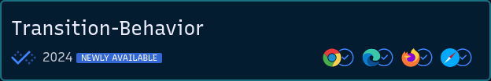
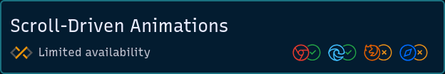

# Astro Baseline Status

A widget displaying Baseline status of a web feature based on https://github.com/web-platform-dx/web-features data.

## Icons





## How to use

Import the Astro component.
Optionally import your browser images. If omitting, the default images will be used.

```jsx
---
import BaselineStatus from "astro-baseline-status";
import Chrome from "./assets/Chrome.svg";
import Edge from "./assets/Edge.svg";
import Firefox from "./assets/Firefox.svg";
import Safari from "./assets/Safari.svg";
---
<BaselineStatus feature-id={feature}>
  <svg
    slot="chrome"
    role="img"
    aria-label={...}
    src={...}
    viewBox={`0 0 ...`}
  />
  <!-- <svg -->
  <!--   slot="edge" -->
  <!--   role="img" -->
  <!--   aria-label={...} -->
  <!--   src={...} -->
  <!--   viewBox={`0 0 ...`} -->
  <!-- /> -->
  <!-- <svg -->
  <!--   slot="firefox" -->
  <!--   role="img" -->
  <!--   aria-label={...} -->
  <!--   src={...} -->
  <!--   viewBox={`0 0 ...`} -->
  <!-- /> -->
  <!-- <svg -->
  <!--   slot="safari" -->
  <!--   role="img" -->
  <!--   aria-label={...} -->
  <!--   src={...} -->
  <!--   viewBox={`0 0 ...`} -->
  <!-- /> -->
</BaselineStatus>
```

## Styling

Style the widget icons using CSS variables.

```css
/* Browser status icon colors */
--baseline-status-color-unavailable: light-dark(#ea8600, #f09418);
--baseline-status-color-newly: light-dark(#1a73e8, #4185ff);
--baseline-status-color-widely: light-dark(#1e8e3e, #24a446);
--baseline-status-color-no_data: light-dark(#707070, #868686);
/* Baseline status icon colors */
--baseline-status-icon-color-limited: light-dark(#c6c6c6, #565656);
--baseline-status-icon-color-newly: light-dark(#1b6ef3, #4185ff);
--baseline-status-icon-dot-color-newly: light-dark(#a8c7fa, #2d509e);
--baseline-status-icon-color-widely: light-dark(#c4eed0, #125225);
--baseline-status-icon-color-no_data: light-dark(#909090, #666666);
```

## Advantages

- 💅 An Bring your own style
- 📷 An Use your own images
